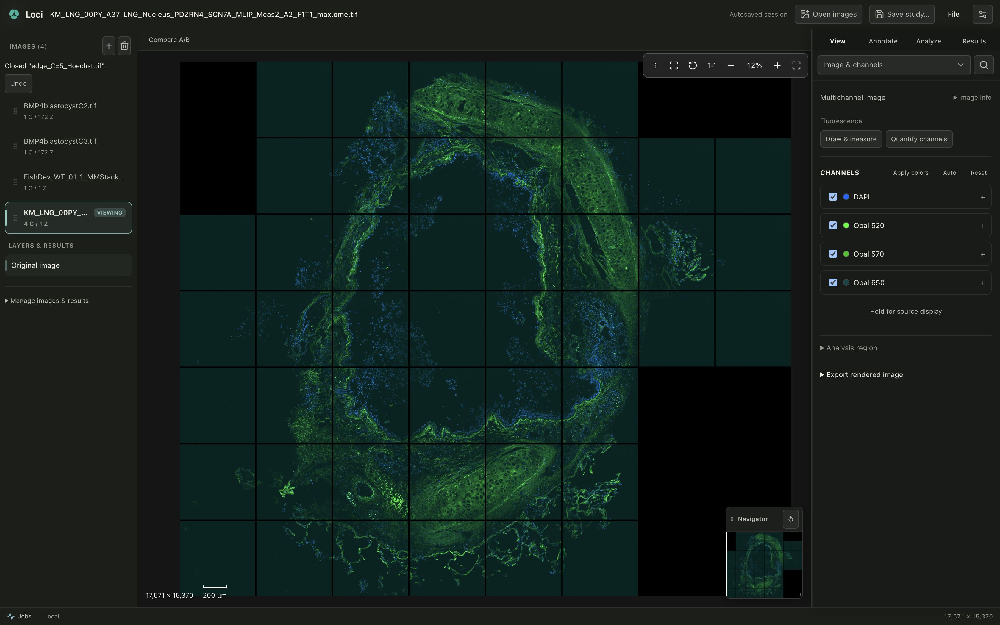
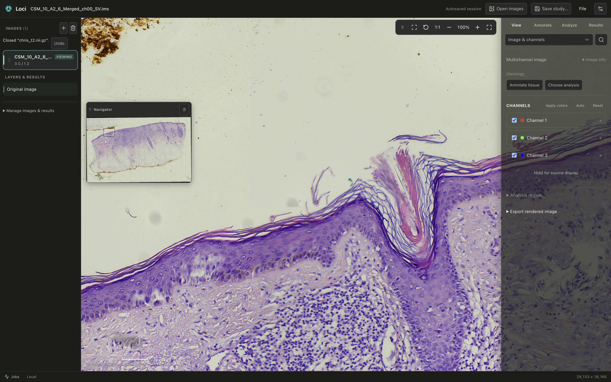
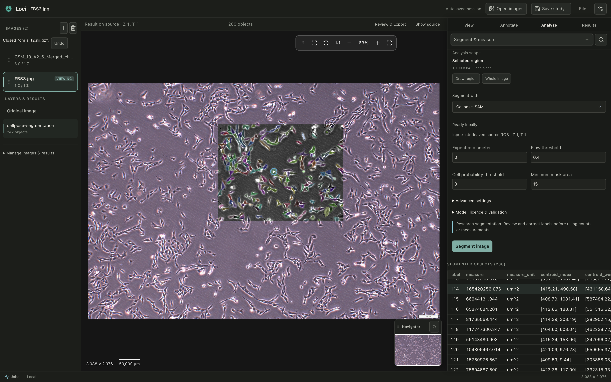

<p align="center">
  
</p>

<h1 align="center">Loci</h1>

<p align="center">
  <strong>A modern, local-first biomedical image analysis workspace for researchers.</strong>
</p>

<p align="center">
  Open microscopy and medical images. Explore, annotate, and analyse locally with zero cloud dependencies.
</p>

<p align="center">
  <a href="https://github.com/sidd-bme/loci-app/releases/tag/v0.1.0-beta.1"></a>
  <a href="LICENSE"></a>
</p>

<p align="center">
  <a href="https://github.com/sidd-bme/loci-app/releases/tag/v0.1.0-beta.1"><strong>Download for Apple Silicon Mac (v0.1.0-beta.1)</strong></a> •
  <a href="#quick-workflow"><strong>Quick workflow</strong></a> •
  <a href="#origin--motivation"><strong>Origin</strong></a>
</p>

> [!WARNING]
> **Public Beta · Research Use Only (RUO)**
> Loci is research software intended exclusively for laboratory and scientific research. It is **not** a certified medical device and is **not** cleared for clinical diagnosis, patient management, or clinical decision-making.
>
> **Beta Installation Notice:** This initial release is signed with an ad-hoc local signature and is **not notarized** by Apple. On first launch, macOS Gatekeeper blocks direct opening. On macOS 15 (Sequoia) and modern macOS releases, approve the application via **System Settings → Privacy & Security → Open Anyway** (or right-click → Open on supported configurations). First launch on Apple Silicon Macs may observe an initial startup delay (~75–85 seconds observed on Apple Silicon M1 with 8 GB RAM) while macOS verifies application components. See [Installation](#installation-macos-public-beta) below.

---

## Overview

Loci is an open-source, local-first desktop imaging workbench built specifically for life-science and biomedical researchers. It brings fluorescence microscopy, whole-slide histology, volumetric time series, and medical volumes together into a unified, responsive desktop application where raw images remain immutable and every derived measurement is traceable.

Viewing and core analysis require **no account, no subscription, and no network connection**. Your data stays entirely on your local machine.

---

## Product tour

<!-- HERO_MEDIA_START: Media assets can be replaced here for launch -->



<!-- HERO_MEDIA_END -->

| Multichannel fluorescence | Native whole-slide detail |
| :---: | :---: |
|  |  |
| *C/Z/T navigation with explicit cyan, magenta, and yellow false-coloring.* | *Navigate gigapixel slides at native resolution without flattening.* |

| Classical segmentation & review | 3D ray-cast volume & MPR |
| :---: | :---: |
|  |  |
| *Discrete object selection, quantitative review tables, and recipe presets.* | *Direct GPU ray-casting and linked orthogonal multi-planar reslicing.* |

*All screenshots and video recordings use rights-cleared public scientific fixtures.*

---

## Origin & motivation

Loci began by helping a small Singapore startup improve its cell-counting workflow using the images and equipment it already had. It grew into an effort to make adaptable scientific image-analysis tools accessible to more labs. I use it in my own research and am refining it through early feedback from researchers working across skin research, 3D imaging and cell culture. These are only early workflow evaluations and not biological/clinical validation, and Loci is always improving through testing between various life science labs, institutions, and clinician scientists.

---

## What Loci does

### 1. Direct, image-first interaction
- **Immediate opening:** Drag and drop files, open folders, or point Loci at an OME-Zarr store. Inspect data immediately without mandatory project setup or destination pre-selection.
- **Responsive navigation:** Pan, zoom anchored to cursor, and browse pyramid levels with bounded-memory reads designed to keep the user interface responsive during large file access.
- **Multi-dimensional exploration:** Seamlessly navigate channel (C), axial depth (Z), and time points (T). Compare display transfers without mutating raw pixel data.

### 2. Interactive research workbench
- **Discrete object selection:** Click objects directly in 2D or 3D viewports to inspect individual morphological and intensity measurements, with view scale preserved.
- **Quantitative review table:** Inspect area, volume, intensity, count, and fraction metrics with unit consistency and explicit non-finite value rejection.
- **Reusable recipe presets:** Save, validate, and restore analysis recipe presets with automatic channel-compatibility verification.
- **Native annotations:** Draw points, boxes, polygons, freehand regions, and calibrated transects directly on raw pixel coordinates.

### 3. Fully offline analysis engine
- **Deterministic classical algorithms:** Thresholding (Otsu, Yen, Li, local), adaptive watershed segmentation, puncta detection, and region statistics run locally in Python without network access.
- **Provisioned deep-learning support:** Run official Cellpose-SAM checkpoints (`cpsam`, `cpsam_v2`) provided directly by the user and verified against exact cryptographic digests.
- **Managed ONNX packages:** Execute compatible managed ONNX models under explicit scale, input grid, and spatial coordinate contracts.

### 4. Traceable scientific evidence
- **Immutable source images:** Loci treats original image files as strictly immutable; raw data is never overwritten.
- **Audit-ready exports:** Export full-resolution 16-bit TIFF arrays, presentation-ready PNGs, and tabular CSV summaries with SHA-256 source fingerprints and parameter records.
- **Portable study sessions:** Save the full workbench state into non-destructive `.loci-study` archives for exact reopening and reproducibility.

---

## Local-first architecture & data containment

Biomedical images are large, sensitive, and scientifically irreplaceable. Loci is architected around clear local-first principles:

- **Local core execution:** Core image viewing, navigation, and built-in analysis run entirely on your local machine with zero telemetry, zero usage tracking, and no silent network calls.
- **Data containment:** Raw images remain in place. Source filesystem paths and local host details are stripped from exported manifests and shareable study logs.
- **Air-gapped operation:** Core workflows operate fully offline in secure laboratory facilities or air-gapped environments.
- **Explicit network boundaries:** Core tools make no network connections. Advanced optional features (such as connecting to a configured remote high-performance compute worker) require explicit user configuration and are never invoked silently.
- **Reproducibility:** Analysis parameters, software version metadata, and source cryptographic digests travel together in durable manifests.

---

## Supported data formats

| Domain | Supported formats | Scope & Notes |
| :--- | :--- | :--- |
| **Microscopy** | TIFF, BigTIFF, OME-TIFF | Multi-channel, Z-stacks, time series, multi-series tiled pyramids |
| **Next-Gen Bioimaging** | OME-NGFF / OME-Zarr (v0.4 / Zarr v2), HDF5 IMS | Modern hierarchical arrays and multiscale pyramids |
| **Digital Pathology** | Aperio SVS, Hamamatsu NDPI | Multiscale whole-slide images with level navigation |
| **Medical / Volumetric** | DICOM, NIfTI-1/2 (`.nii`, `.nii.gz`), NRRD | Scalar volumetric series with spatial orientation preserved |
| **General** | PNG, JPEG | Single-plane images with sRGB/grayscale handling |

*For complete format boundaries and operation matrices, see [Capabilities by format](docs/CAPABILITY_MATRIX.md).*

---

## Getting started

### Installation (macOS Public Beta)

1. Download **`Loci-0.1.0-beta.1-darwin-arm64.zip`** from the [GitHub Releases](https://github.com/sidd-bme/loci-app/releases/tag/v0.1.0-beta.1) page.
2. *(Recommended)* Verify the SHA-256 checksum in Terminal:
   ```bash
   shasum -a 256 Loci-0.1.0-beta.1-darwin-arm64.zip
   # Expected: 5d1943627605ce40dfba27694a22f03b33884bd42d703a1d49ca054d2f926ece
   ```
3. Unzip the archive and move `Loci.app` to your `/Applications` folder.
4. **First-launch Gatekeeper approval:** Because this initial beta release uses an ad-hoc local integrity signature and is **not notarized** by Apple, macOS Gatekeeper blocks direct double-click launching on downloaded files. Follow the standard Apple-documented approval procedure:
   - **On macOS 15 (Sequoia) and modern macOS versions:**
     1. Double-click `Loci.app` in `/Applications` once. macOS will display a prompt stating that the app cannot be opened because it is not from an identified developer. Click **Done** or **OK**.
     2. Open **System Settings → Privacy & Security**.
     3. Scroll down to the **Security** section. You will see: *"Loci.app was blocked from use because it is not from an identified developer."*
     4. Click **Open Anyway**, enter your Mac password or Touch ID when prompted, and click **Open**.
   - **On earlier macOS versions (macOS 14 Sonoma and earlier):**
     Right-click (or Control-click) `Loci.app` in `/Applications` and select **Open**. In the dialog that appears, click **Open**. *(Note: macOS Sequoia restricts this shortcut by default in favor of System Settings approval).*
   *Note for managed Macs: On institutional or enterprise-managed Macs with centrally enforced MDM configuration profiles, running unnotarized applications may require your organization's IT administrator to grant an exception.*
5. **Initial startup timing:** On first launch on Apple Silicon Macs, an initial startup delay of approximately **75–85 seconds** has been observed (tested on Apple Silicon M1 with 8 GB RAM) while macOS verifies application components and the analysis environment initializes. Subsequent launches open faster once cached by the system.

<a id="quick-workflow"></a>
### Quick workflow (tested with built-in classical methods)

1. **Open an image:** Launch Loci and drag a supported image (e.g. multi-channel TIFF or OME-TIFF) into the workbench window.
2. **Adjust channels:** Open the **View → Image & channels** panel in the left toolbar to toggle channel visibility, assign false colors, and adjust display window/level ranges.
3. **Run segmentation:** Switch to **Analyze → Segment & measure**, select the built-in **Adaptive Watershed** profile, adjust parameter thresholds if desired, and click **Segment image**.
4. **Inspect objects & review measurements:** Switch to **Results → Review & export** to inspect the interactive measurement table, morphology metrics, and quantitative summaries. Click any row in the table or click an object directly in the viewport to highlight and inspect its measurements. **Perform human visual and numerical review of all detected objects and boundary alignments before proceeding to export.**
5. **Export results:** In **Review & export**, click **Export** to export tabular CSV summaries, 16-bit TIFF label arrays, or rendered figure images with SHA-256 provenance manifests.
6. **Save study:** Choose **File → Save research study as** to save your workspace session as a `.loci-study` bundle for exact reopening and reproducibility.

---

## Scientific boundaries & research-use notice

> [!WARNING]
> **Research Use Only (RUO)**
> Loci is research software intended exclusively for laboratory and scientific research. It is **NOT** a certified medical device and is **NOT** cleared for clinical diagnosis, patient management, or medical treatment planning.

- **No clinical or biological claims:** Segmentation counts and intensity calculations reflect mathematical algorithms applied to pixel values; they do not establish biological viability, tissue classification, or clinical diagnoses.
- **Model checkpoints are not bundled:** Loci does not bundle or automatically download learned model weights (such as Cellpose-SAM checkpoints). Users supply official checkpoints directly. Commercial use of third-party checkpoints remains subject to their upstream licenses.
- **Independent calibration:** Quantitative measurements depend on user-verified microscope calibration (microns per pixel). Uncalibrated images are reported in raw pixel units.

---

## Technical architecture & implementation notes

For developers, contributors, and technical evaluators interested in internal engineering:

- **Desktop Shell:** Electron 44, React 19, TypeScript, and Vite. Implements bounded tile caching, cursor-anchored pan/zoom, and native canvas overlays.
- **3D Visualization:** Direct GPU ray-casting and orthogonal multi-planar reformatting implemented via `@kitware/vtk.js`.
- **Discrete Object Picking:** Viewport canvas picking queries spatial label identities (`result_label_at`) preserving camera scale and active layer hierarchy.
- **Numerical Integrity:** Quantitative review tables reject non-finite and `NaN` values at the engine boundary and enforce unit consistency across area, volume, and intensity metrics.
- **Analysis Engine:** Bundled Python 3.12 worker frozen with PyInstaller. Exposes deterministically verifiable operations via JSON-RPC, including classical SciPy/scikit-image routines and Model Context Protocol (MCP) tool bindings.

---

## Developing & building from source

Loci consists of an Electron + React + TypeScript desktop frontend and a Python 3.12 scientific analysis engine.

### Prerequisites

- macOS (Apple Silicon arm64 recommended) or Linux x64
- Node.js >= 24
- Python 3.11–3.13 (Python 3.12 recommended)
- [`uv`](https://docs.astral.sh/uv/) package manager

### Setup & Run

```bash
# 1. Clone the repository
git clone https://github.com/sidd-bme/loci-app.git
cd loci-app

# 2. Setup the Python analysis engine
cd engine
uv sync --extra dev --extra onnx
uv run ruff check .
uv run pytest

# 3. Setup and start the desktop shell
cd ../desktop
npm ci
npm run check
npm start
```

For packaging, production builds, and regression validation, see [Building Loci](docs/BUILDING.md).

---

## Multi-agent & AI development context

Loci maintains a model-neutral development standard designed for human developers and AI coding assistants:

- [AGENTS.md](AGENTS.md) — Shared development principles and scientific invariants.
- [docs/COLLABORATION.md](docs/COLLABORATION.md) — Shared collaboration protocol.
- [docs/NEW_AGENT_PROMPT.md](docs/NEW_AGENT_PROMPT.md) — Onboarding prompt for new agent sessions.
- [.agents/skills/](.agents/skills/README.md) — Reusable, license-vetted interface and design engineering skills.

---

## Contributing

We welcome contributions from biomedical researchers, image analysts, and software engineers. Please read [CONTRIBUTING.md](CONTRIBUTING.md) and [SECURITY.md](SECURITY.md) before opening a pull request or issue.

---

## License & Attribution

- **Loci application & engine:** Licensed under the [Apache License, Version 2.0](LICENSE).
- **Third-party software notices:** See [THIRD_PARTY_NOTICES.md](THIRD_PARTY_NOTICES.md).
- **Public fixtures & demo media:** Licensed under [CC0-1.0 Universal](docs/media/README.md).
