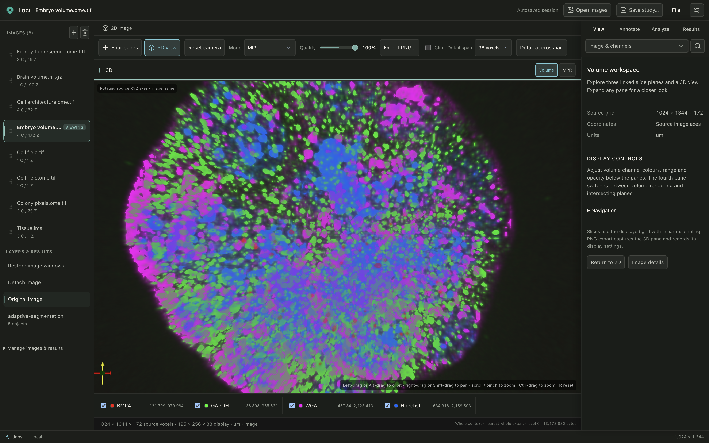
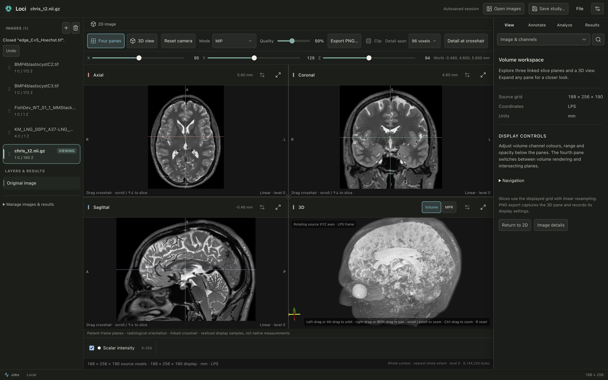
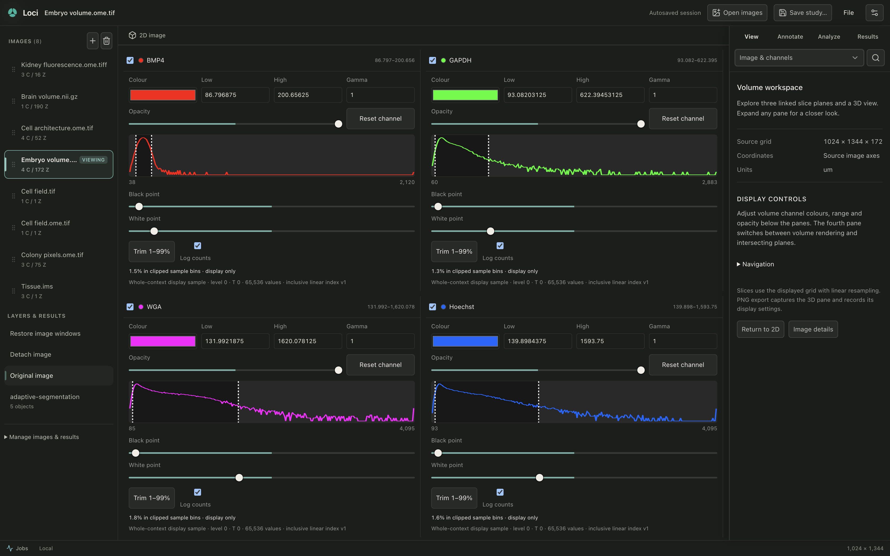

  

<h1 align="center">Loci</h1>

<strong>A workspace for scientific images.</strong>

Explore microscopy, annotate regions, and turn images into measurements.

  <a href="https://github.com/sidd-bme/loci-app/releases/tag/v0.1.0-beta.1">Download the beta</a> ·
  <a href="docs/README.md">Documentation</a> ·
  <a href="https://github.com/sidd-bme/loci-app/issues">Feedback</a> ·
  <a href="https://ko-fi.com/lociimaging">Support :D</a>

Loci brings viewing, annotation, segmentation and quantitative review into one desktop workspace. Work with fluorescence images, histology and 3D volumes while keeping your original data intact. Core viewing and analysis run locally, with no account or cloud service required.

## From image to insight

- **Explore your images.** Navigate channels, Z-stacks and time points; adjust colour and contrast; inspect slides and volumes.
- **Define what matters.** Draw regions, annotate structures and make calibrated measurements directly on the image.
- **Segment and measure.** Use classical methods or configured Cellpose models, then inspect individual objects and their measurements.
- **Keep the context.** Review results, export tables and figures, and save studies with their analysis settings and source references.

| Fluorescence, channel by channel | Histology in detail |
| :--- | :--- |
|  |  |
| Tune channels and explore individual planes. | Inspect tissue and define regions on the source image. |

| Volumes from every angle | Advanced display controls |
| :--- | :--- |
|  |  |
| Connect 3D structure with linked slice views. | Adjust colour, contrast and opacity with channel histograms. |

Real application captures, including development builds. The published download remains v0.1.0-beta.1; current source and screenshots can show newer work. See the [release record](docs/RELEASE_STATUS.md) for its exact scope. [Image credits](docs/media/README.md).

## Try Loci

The current download is **v0.1.0-beta.1 for Apple Silicon Macs**. Loci is actively developed, and feedback from research workflows helps shape each iteration.

**[Download for macOS](https://github.com/sidd-bme/loci-app/releases/tag/v0.1.0-beta.1)** → **[Install & first launch](docs/INSTALLATION.md)** → **[Start your first study](docs/USING_LOCI.md#start-save-and-return)**

The installation guide covers macOS approval for this beta. For image formats, model setup and workflow details, browse the [documentation](docs/README.md).

## Built around research

Loci began with a practical cell-counting workflow and grew into a broader imaging workspace. The aim is to make everyday image analysis easier to navigate, with source data, analysis settings and results kept connected.

Researchers, image analysts and developers are welcome to [share feedback](https://github.com/sidd-bme/loci-app/issues) or [contribute](CONTRIBUTING.md). Developers can start with the [extension guide](docs/EXTENDING_LOCI.md).

---

[Apache-2.0](LICENSE) · [Third-party notices](THIRD_PARTY_NOTICES.md) · [Security](SECURITY.md)

Beta research software; not intended for clinical diagnosis.
