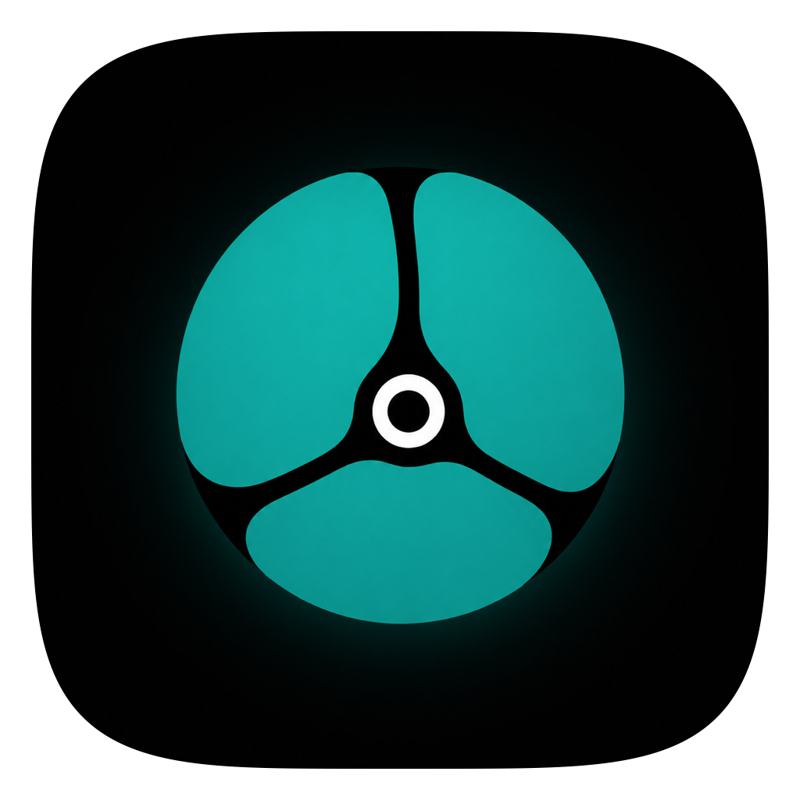
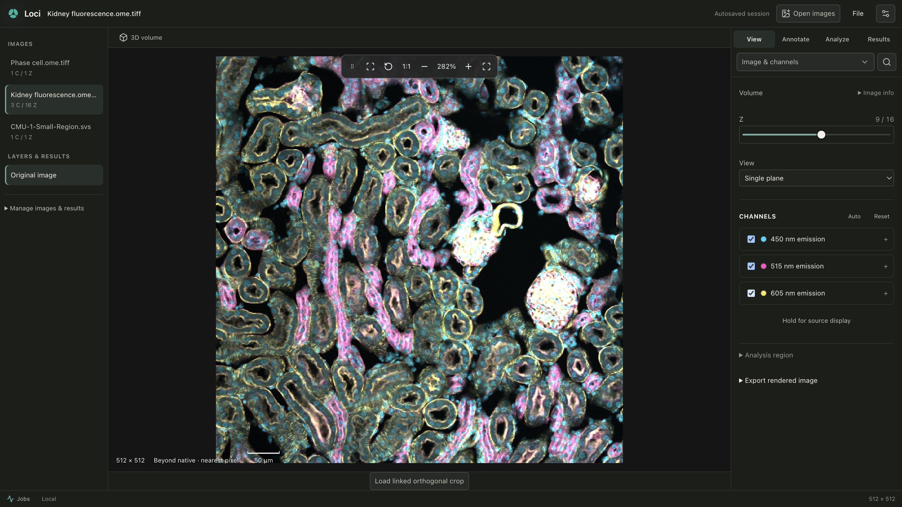
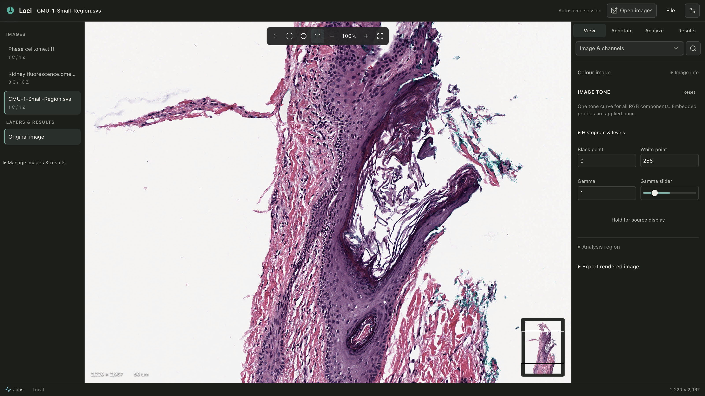
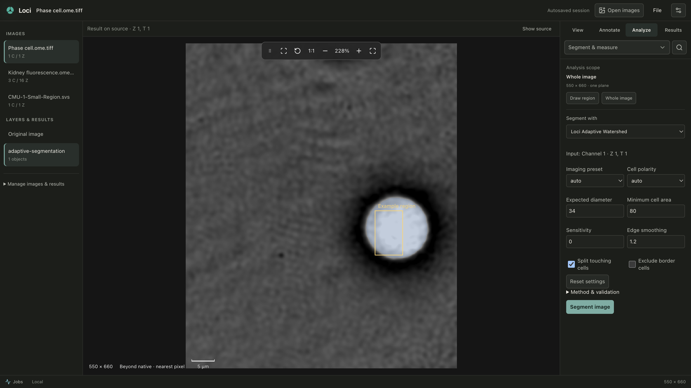
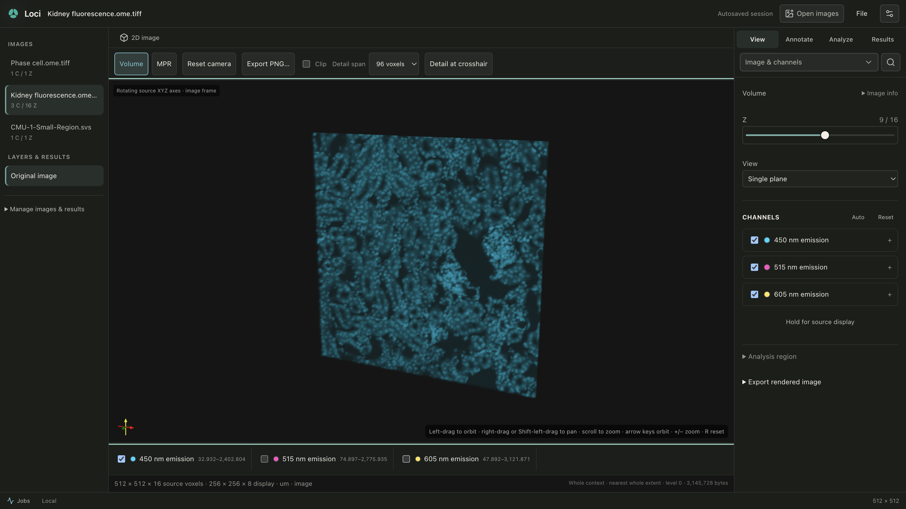

<p align="center">
  
</p>

<h1 align="center">Loci</h1>

<p align="center">
  <strong>A modern, local-first biomedical image analysis workspace for researchers.</strong>
</p>

<p align="center">
  Open an image. Explore, annotate, and analyse locally with zero cloud dependencies.
</p>

<p align="center">
  <a href="https://github.com/sidd-bme/loci-app/releases"></a>
  <a href="LICENSE"></a>
  <a href="https://github.com/sidd-bme/loci-app/actions/workflows/engine-ci.yml"></a>
</p>

---

## Overview

Loci is an open-source, local-first desktop imaging workbench built specifically for life-science and biomedical researchers. It brings fluorescence microscopy, whole-slide histology, volumetric time series, and medical volumes together into a unified, responsive application where raw images remain immutable and every derived result is traceable.

Viewing and core analysis require **no account, no subscription, and no cloud connection**. Your research data stays on your machine.

---

## Product tour

<!-- HERO_MEDIA_START: Media assets can be replaced here for launch -->
[](docs/media/loci-product-demo-1080p.mp4)

<p align="center">
  <strong><a href="docs/media/loci-product-demo-1080p.mp4">Watch the product demo video (1 min 19 s)</a></strong>
</p>
<!-- HERO_MEDIA_END -->

| Multichannel fluorescence | Native whole-slide detail |
| :---: | :---: |
|  |  |
| *C/Z/T navigation with explicit cyan, magenta, and yellow false-coloring.* | *Navigate gigapixel slides at native resolution without flattening.* |

| Classical segmentation & review | 3D ray-cast volume & MPR |
| :---: | :---: |
|  |  |
| *Discrete object picking, quantitative review tables, and recipe presets.* | *Direct GPU ray-casting and linked orthogonal slicing via vtk.js.* |

*All screenshots and video recordings use three rights-cleared public **CC0-1.0** scientific fixtures. See [media credits and provenance](docs/media/README.md).*

---

## What Loci does

### 1. Direct, image-first interaction
- **Immediate opening:** Drag and drop files, open folders, or point Loci at an OME-Zarr store. Start inspecting data before naming a study or choosing a destination.
- **Responsive navigation:** Pan, zoom anchored to your cursor, and browse pyramid levels with bounded-memory reads that never freeze your interface.
- **Multi-dimensional exploration:** Seamlessly navigate channel (C), axial depth (Z), and time points (T). Compare display transfers without mutating raw pixel data.

### 2. Interactive research workbench
- **Discrete object picking:** Click objects directly in 2D or 3D viewports (`result_label_at`) to inspect individual morphological and intensity measurements, with camera scale preserved.
- **Quantitative review table:** Inspect area, volume, intensity, count, and fraction metrics with unit consistency and explicit NaN/non-finite rejection.
- **Reusable recipe presets:** Save, validate, and restore analysis recipe presets with automatic channel-compatibility verification.
- **Native annotations:** Draw points, boxes, polygons, freehand regions, and calibrated transects directly on raw pixel coordinates.

### 3. Fully offline analysis engine
- **Deterministic classical algorithms:** Thresholding (Otsu, Yen, Li, local), adaptive watershed segmentation, puncta detection, and region statistics run locally in Python without network access.
- **Provisioned deep-learning support:** Run Cellpose-SAM models using your own official checkpoints (`cpsam`, `cpsam_v2`) verified against exact cryptographic digests.
- **Managed ONNX packages:** Execute pre-packaged ONNX models under explicit scale, input grid, and spatial coordinate contracts.

### 4. Traceable scientific evidence
- **Immutable source images:** Loci never writes into or modifies original image files.
- **Audit-ready exports:** Export full-resolution 16-bit TIFF arrays, presentation-ready PNGs, and tabular CSV summaries with SHA-256 source fingerprints and parameter records.

---

## Why local-first?

Biomedical images are large, sensitive, and scientifically irreplaceable. Loci is architected around strict local-first guarantees:

- **Absolute privacy:** Zero telemetry, no analytics tracking, no user profiling, and no silent network calls.
- **Air-gapped operation:** Works fully offline in secure laboratory facilities or flight environments.
- **Data sovereignty:** Raw files never leave your local filesystem or authorized mounted storage.
- **Reproducibility:** Analysis parameters, software versions, and source digests travel together in durable manifests.

---

## Supported data formats

| Domain | Supported formats | Scope & Notes |
| :--- | :--- | :--- |
| **Microscopy** | TIFF, BigTIFF, OME-TIFF | Multi-channel, Z-stacks, time series, multi-series tiled pyramids |
| **Next-Gen Bioimaging** | OME-NGFF / OME-Zarr (v0.4 / Zarr v2), HDF5 IMS | Modern hierarchical arrays and multiscale pyramids |
| **Digital Pathology** | Aperio SVS, Hamamatsu NDPI | Multiscale whole-slide images with level navigation |
| **Medical / Neuroimaging** | DICOM, NIfTI-1/2 (`.nii`, `.nii.gz`), NRRD | Scalar volumetric series with spatial orientation preserved |
| **General** | PNG, JPEG | Single-plane images with sRGB/grayscale handling |

*For format boundaries and operation matrices, see [Capabilities by format](docs/CAPABILITY_MATRIX.md).*

---

## Getting started

### Installation (macOS Public Beta)

1. Download `Loci-0.1.0-beta.1-darwin-arm64.zip` from the [Releases](https://github.com/sidd-bme/loci-app/releases) page.
2. Unzip and drag `Loci.app` to your `/Applications` folder.
3. **First-launch Gatekeeper notice:** Because this initial beta uses an ad-hoc local integrity signature, macOS may display an "unidentified developer" prompt. Either:
   - Run in Terminal: `xattr -cr /Applications/Loci.app`
   - Or right-click (Control-click) `Loci.app` in Finder and click **Open**.
4. **First-launch initialization:** On very first launch, the bundled analysis engine unpacks and verifies its scientific runtime. This initial cold start takes approximately **75–85 seconds**. Subsequent launches warm up and start immediately.

### Quick workflow (5 minutes)

1. **Open an image:** Launch Loci and drag any supported TIFF, SVS, or OME-Zarr file into the window.
2. **Adjust channels:** Click the Channels panel in the left sidebar to toggle visibility, select false colors, and adjust min/max display ranges.
3. **Run segmentation:** Switch to **Analyze → Segment objects**, select **Adaptive watershed**, preview the contours, and click **Adopt result**.
4. **Inspect objects:** Open **Results → Info** to view the interactive measurement table. Click any row to center and highlight the corresponding cell in the viewport.
5. **Export:** Click **Export** in the top toolbar to generate publication-ready figures or CSV measurement tables with cryptographic provenance.

---

## Scientific boundaries & research-use notice

> [!WARNING]
> **Research Use Only (RUO)**
> Loci is research software intended exclusively for laboratory and scientific research. It is **NOT** a certified medical device and is **NOT** cleared for clinical diagnosis, patient management, or medical treatment planning.

- **No clinical or biological claims:** Segmentation counts and intensity calculations reflect mathematical algorithms applied to pixel values; they do not establish biological viability, tissue classification, or clinical diagnoses.
- **Model weights are not bundled:** Loci does not bundle or automatically download learned model weights (such as Cellpose-SAM checkpoints). Users supply official checkpoints directly. Commercial use of third-party checkpoints remains subject to their upstream licenses.
- **Independent calibration:** Quantitative measurements depend on user-verified microscope calibration (microns per pixel). Uncalibrated images are reported in raw pixel units.

---

## Developing & building from source

Loci consists of an Electron + React + TypeScript desktop frontend and a Python 3.12 scientific analysis engine.

### Prerequisites

- macOS (Apple Silicon arm64 recommended) or Linux x64
- Node.js >= 24
- Python 3.11–3.13 (Python 3.12 recommended)
- [`uv`](https://docs.astral.sh/uv/) package manager

### Setup & Run

```bash
# 1. Clone the repository
git clone https://github.com/sidd-bme/loci-app.git
cd loci-app

# 2. Setup the Python analysis engine
cd engine
uv sync --extra dev --extra onnx
uv run ruff check .
uv run pytest

# 3. Setup and start the desktop shell
cd ../desktop
npm ci
npm run check
npm start
```

For packaging, production builds, and regression validation, see [Building Loci](docs/BUILDING.md).

---

## Multi-agent & AI development context

Loci maintains a model-neutral, multi-agent development standard designed for human developers and AI assistants (Codex, Antigravity, Claude, Gemini).

- [AGENTS.md](AGENTS.md) — Shared development principles and scientific invariants.
- [docs/COLLABORATION.md](docs/COLLABORATION.md) — Shared collaboration protocol.
- [docs/NEW_AGENT_PROMPT.md](docs/NEW_AGENT_PROMPT.md) — Onboarding prompt for new agent sessions.
- [.agents/skills/](.agents/skills/README.md) — Reusable, license-vetted interface and design engineering skills.

---

## Contributing

We welcome contributions from biomedical researchers, image analysts, and software engineers. Please read [CONTRIBUTING.md](CONTRIBUTING.md) and [SECURITY.md](SECURITY.md) before opening a pull request or issue.

---

## License & Attribution

- **Loci application & engine:** Licensed under the [Apache License, Version 2.0](LICENSE).
- **Third-party software notices:** See [THIRD_PARTY_NOTICES.md](THIRD_PARTY_NOTICES.md).
- **Public fixtures & demo media:** Licensed under [CC0-1.0 Universal](docs/media/README.md).
